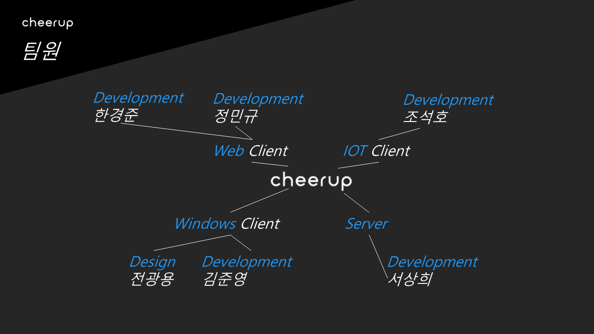
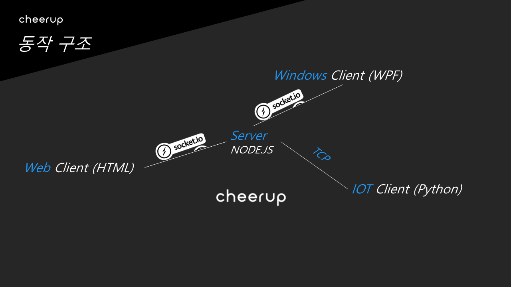
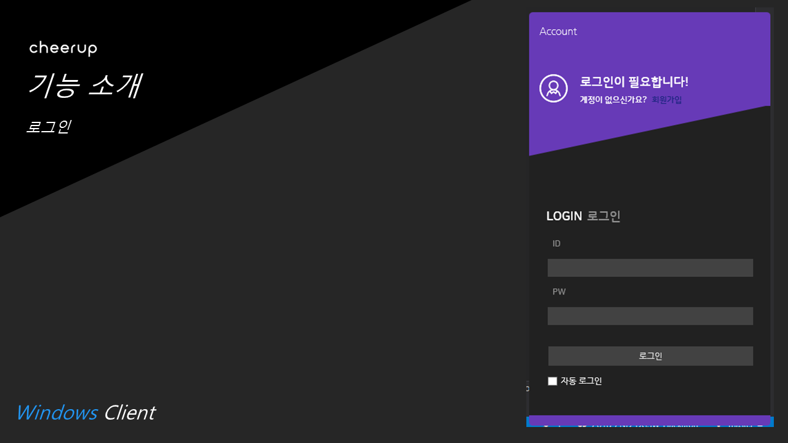
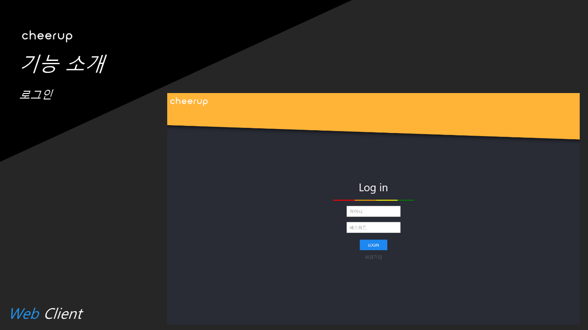
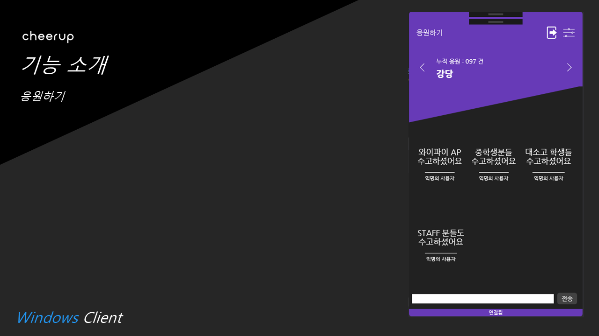
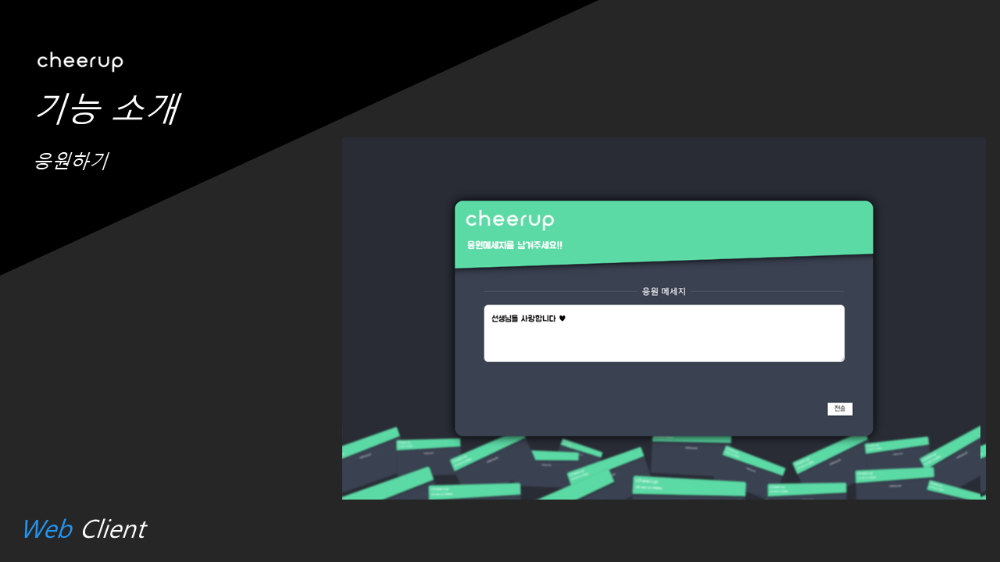
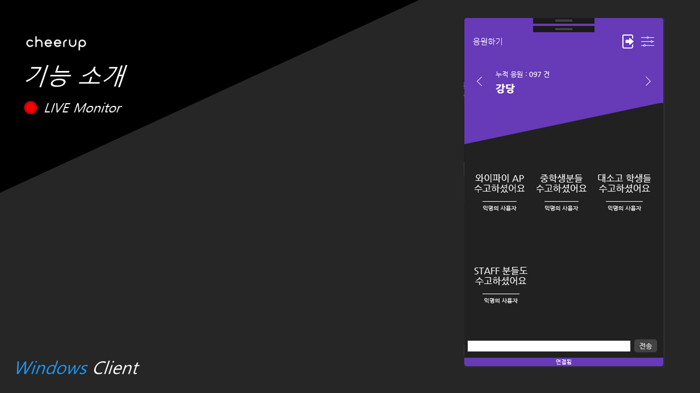
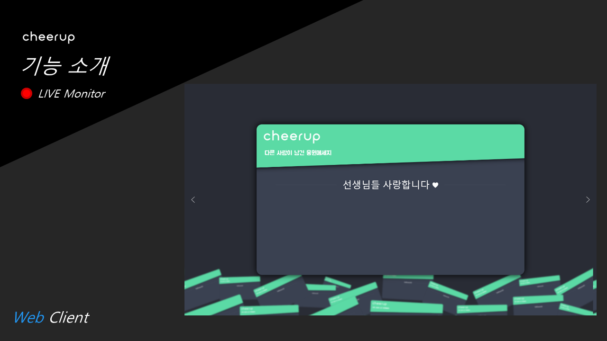
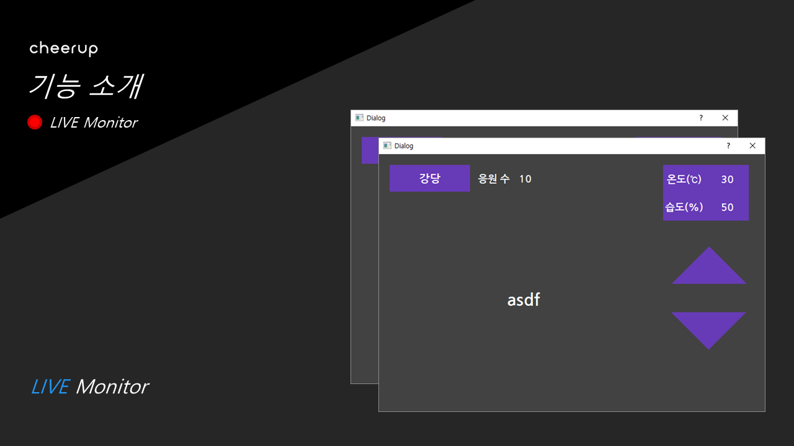

# CheerUp

> 고마운 분들에게 따뜻한 고마움을 전달하는 솔루션,

  

    
  

대구소프트웨어고등학교 2018-11-10 ~ 2018-11-11 교내 해커톤 행사 1조 팀

## 역할

* [**Windows**](https://github.com/DevJeon1358/CheerUp/tree/master/Windows%20Client) (WPF) - [전광용](https://github.com/DevJeon1358), [김준영](https://github.com/MAR1026)
* [**Server**](https://github.com/DevJeon1358/CheerUp/tree/master/Server) (Node.js) - [서상희](https://github.com/tbvjaos510)
* [**Web**](https://github.com/DevJeon1358/CheerUp/tree/master/WEB) (UIkit) - [정민규](https://github.com/mingyu0403), [한경준](https://github.com/esusige3)
* [**Raspberry Pi**](https://github.com/DevJeon1358/CheerUp/tree/master/Pi) (Python) - [조석호](https://github.com/Jawsco)

## 사용 API

* Node, Web - [Socket.io](https://github.com/socketio/socket.io)
* C# - [SocketIoClientDotNet](https://github.com/Quobject/SocketIoClientDotNet)
* Web - [UIkit](https://github.com/uikit/uikit)

# 기능 소개

  

    
    
    
    
    
    
    
  

### 수고 많았어!
